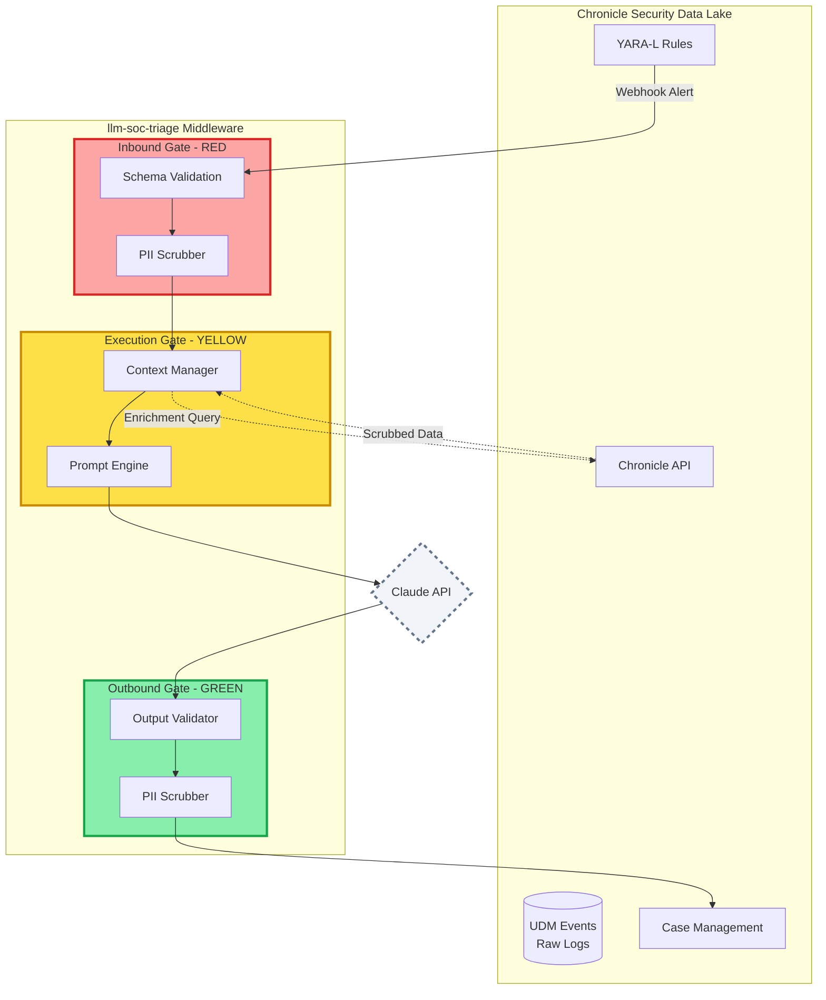

# Google Chronicle Integration Guide

## Overview

This document provides comprehensive guidance for integrating Google Chronicle with the `llm-soc-triage` middleware, maintaining the "Sandwich Model" security architecture with PII scrubbing at all data boundaries.

Chronicle serves three critical roles:
1. **Alert Source**: YARA-L rules detect patterns and forward UDM events via webhook
2. **Context Enrichment**: API queries provide prevalence, baselines, and network intelligence
3. **SOAR Destination**: Triage results create cases and annotate UDM events

---

## Architecture: Security Boundaries

### The Three-Layer Security Model



### PII Data Flow and Scrubbing Points

| Data Flow | Contains PII? | Scrubbing Rule |
|-----------|---------------|----------------|
| **Boundary 1**: Chronicle UDM → Middleware | Yes (IPs, emails, hostnames, usernames) | **MANDATORY scrubbing** before LLM |
| **Boundary 2**: Chronicle API → Middleware | Yes (hostnames, users in responses) | **MANDATORY scrubbing** before LLM |
| **Boundary 3**: Middleware → Chronicle Cases | Maybe (in AI reasoning text) | **CONFIGURABLE** (default: false for internal) |
| **Boundary 4**: Middleware → UDM Annotations | Maybe (in AI reasoning text) | **ALWAYS scrubbed** (compliance, non-configurable) |

---

## Setup Guide

### Prerequisites

- Google Chronicle account with API access
- Service account with appropriate permissions
- Middleware deployed and accessible via HTTPS
- API key for webhook authentication

### Step 1: Create Chronicle Service Account

```bash
# In Google Cloud Console
1. Navigate to IAM & Admin > Service Accounts
2. Create service account: "llm-soc-triage-chronicle"
3. Grant roles:
   - Chronicle API Read
   - Chronicle API Write
   - Chronicle Case Manager
4. Create JSON key
5. Download to secure location
```

### Step 2: Configure Middleware

Update `.env` with Chronicle credentials:

```bash
# Chronicle API Credentials
CHRONICLE_CREDENTIALS_FILE=/path/to/chronicle-service-account.json
CHRONICLE_CUSTOMER_ID=your_customer_id_here
CHRONICLE_REGION=us  # or europe, asia

# Webhook Security
CHRONICLE_WEBHOOK_SECRET=generate_strong_random_secret

# Feature Flags
CHRONICLE_CONTEXT_ENRICHMENT=true
CHRONICLE_SOAR_INTEGRATION=true
CHRONICLE_UDM_ANNOTATIONS=true

# PII Scrubbing Policy
SCRUB_PII_FOR_CHRONICLE=false  # Chronicle is internal, full context helpful
```

### Step 3: Deploy YARA-L Rules

1. Navigate to Chronicle > Detection > Rules
2. Create new rule
3. Copy content from `docs/chronicle_yara_rules/idor_detection.yaral`
4. Update webhook URL: `https://your-middleware.com/v1/chronicle/webhook`
5. Create secret for `MIDDLEWARE_API_KEY`
6. Test rule with historical data
7. Deploy to production

### Step 4: Configure Webhook Endpoint

Ensure middleware is accessible:

```bash
# Test webhook endpoint
curl -X POST https://your-middleware.com/v1/chronicle/webhook \
  -H "Content-Type: application/json" \
  -H "X-Chronicle-Signature: sha256=test" \
  -H "Authorization: Bearer your_api_key" \
  -d '{"rule_id": "test", "rule_name": "Test Rule", ...}'
```

### Step 5: Verify Integration

```bash
# Check health endpoint
curl https://your-middleware.com/health

# Expected response includes Chronicle status:
{
  "status": "healthy",
  "configuration": {
    "chronicle_enabled": true,
    "chronicle_context_enrichment": true,
    "chronicle_soar_integration": true
  }
}
```

---

## PII Scrubbing Decision Matrix

### When to Scrub PII

| Data Type | Scrub Before LLM? | Scrub Before Chronicle? | Reasoning |
|-----------|-------------------|-------------------------|-----------|
| **UDM Events (Inbound)** | **YES (Required)** | N/A | Raw logs contain emails, IPs, hostnames. LLM must not see PII. |
| **Chronicle API Responses** | **YES (Required)** | N/A | Prevalence/baseline data contains hostnames, IPs. Scrub before LLM context. |
| **Chronicle Case Data** | N/A | **CONFIGURABLE** (default: no) | Chronicle is internal. Analysts benefit from full context. Set `SCRUB_PII_FOR_CHRONICLE=true` if external. |
| **UDM Annotations** | N/A | **YES (Always)** | Long-term storage compliance (GDPR, SOC 2). Non-configurable. |

### Configuration Decision Tree

```
Is Chronicle hosted externally (e.g., shared tenant)?
├─ YES → Set SCRUB_PII_FOR_CHRONICLE=true
└─ NO → Is your organization subject to strict data minimization rules?
    ├─ YES → Set SCRUB_PII_FOR_CHRONICLE=true
    └─ NO → Keep SCRUB_PII_FOR_CHRONICLE=false (full analyst context)

Note: UDM annotations ALWAYS scrubbed regardless of configuration.
```

---

## Context Enrichment Examples

### Asset Prevalence Query

```python
# Middleware queries Chronicle for IOC prevalence
prevalence = await chronicle_client.get_asset_prevalence(
    indicator="abc123hash",
    indicator_type="hash",
    time_range="30d"
)

# Result (PII-scrubbed):
{
    "affected_assets": 3,
    "first_seen": "2026-01-10T14:32:00Z",
    "last_seen": "2026-01-27T09:15:00Z",
    "asset_names": ["[HOSTNAME_REDACTED]", "[HOSTNAME_REDACTED]", "[HOSTNAME_REDACTED]"]
}

# Formatted for LLM prompt:
"This hash seen on 3 hosts in last 30 days (uncommon)"
```

### User Baseline Query

```python
# Query user behavior baseline
baseline = await chronicle_client.get_user_baseline(
    user_id="user_123",
    lookback_days=30
)

# Result (PII-scrubbed):
{
    "typical_login_locations": ["US-East", "US-West"],
    "typical_source_ips": ["[IP_REDACTED]", "[IP_REDACTED]"],
    "average_daily_logins": 2.3
}

# Formatted for LLM prompt:
"User typically logs in from: US-East, US-West. Average 2.3 logins/day."
```

### Network Context Query

```python
# Check IP reputation and history
context = await chronicle_client.get_network_context(
    ip_address="1.2.3.4",
    lookback_days=90
)

# Result (PII-scrubbed):
{
    "connection_count": 0,
    "first_seen": None,
    "last_seen": None,
    "reputation_score": None
}

# Formatted for LLM prompt:
"New IP - 0 prior connections to our infrastructure"
```

---

## SOAR Integration Workflows

### Workflow 1: Chronicle Case Creation

```python
# High-confidence IDOR detection triggers Chronicle case
case_request = ChronicleCaseRequest(
    title="IDOR Attack Detected: CRITICAL",
    description="Sequential enumeration of 4 loan IDs...",
    severity=ChronicleSeverity.CRITICAL,
    iocs=[],
    affected_users=["user_123"],
    mitre_tactics=["TA0009"],
    mitre_techniques=["T1213", "T1213.002"],
    ai_reasoning="Ownership-aware detection confirmed...",
    confidence_score=0.95
)

result = await chronicle_client.create_case(
    case_request,
    scrub_pii=False  # Internal Chronicle, full context
)

# Result:
{
    "success": True,
    "case_id": "CHR-2026-001234",
    "case_url": "https://us.chronicle.security/cases/CHR-2026-001234"
}
```

### Workflow 2: UDM Event Annotation

```python
# Annotate original UDM events with AI reasoning
annotation = ChronicleUDMAnnotation(
    event_id="udm_event_xyz789",
    event_timestamp=datetime.utcnow(),
    annotation_type="ai_idor_detection",
    annotation_text="IDOR Attack Detected: User attempted...",
    triage_result="CRITICAL_IDOR_ATTACK",
    confidence=0.95,
    tags=["idor_attack", "ownership_violation"],
    mitre_tactics=["TA0009"],
    mitre_techniques=["T1213.002"]
)

# ALWAYS PII-scrubbed before Chronicle
result = await chronicle_client.annotate_udm_event(annotation)

# Result:
{
    "success": True,
    "annotation_id": "ANN-2026-005678"
}
```

### Workflow 3: Combined Case + Annotation

```python
# Most common pattern: Create case AND annotate UDM
result = await soar_integration.send_to_chronicle(
    event=idor_detection_event,
    create_case=True,
    annotate_udm=True
)

# Result:
{
    "success": True,
    "case_created": True,
    "case_id": "CHR-2026-001234",
    "case_url": "https://...",
    "udm_annotations": ["ANN-2026-005678", "ANN-2026-005679"]
}
```

---

## YARA-L Rule Deployment

### Rule Customization Checklist

Before deploying YARA-L rules to production:

- [ ] Update `webhook_url` with your middleware endpoint
- [ ] Create `MIDDLEWARE_API_KEY` secret in Chronicle
- [ ] Adjust URL regex for your API endpoint structure
- [ ] Customize session identifier extraction
- [ ] Test with historical UDM data
- [ ] Validate webhook payload format
- [ ] Confirm middleware receives and processes alerts
- [ ] Monitor false positive rate for first week
- [ ] Tune thresholds based on environment

### Session Identifier Extraction

YARA-L rules need to extract session identifiers. Common patterns:

**Option 1: Cookie-based**
```yaral
$e.network.http.request_headers.cookie matches /session_id=([a-zA-Z0-9\-]+)/
```

**Option 2: Custom Header**
```yaral
$e.network.http.request_headers["x-acme-id"] != ""
```

**Option 3: DataDog RUM**
```yaral
$e.network.http.request_headers["x-datadog-session-id"] != ""
```

**Option 4: JWT Token**
```yaral
$e.network.http.request_headers.authorization matches /Bearer\s+([a-zA-Z0-9\-\.]+)/
```

### URL Pattern Matching

Adjust regex for your API structure:

```yaral
# Example 1: Versioned API with numeric IDs
$e.target.url matches /\/api\/v[12]\/consumer\/loan_applications\/\d+/

# Example 2: UUID-based resources
$e.target.url matches /\/api\/loans\/[a-f0-9\-]{36}/

# Example 3: Multiple resource types
$e.target.url matches /\/api\/(loans|accounts|documents)\/\d+/
```

---

## Troubleshooting

### Issue 1: Webhook Not Receiving Alerts

**Symptoms**: YARA-L rule triggers but middleware webhook never called.

**Diagnosis**:
```bash
# Check Chronicle rule logs
Chronicle UI > Detection > Rules > [Your Rule] > Execution History

# Check middleware logs
grep "CHRONICLE_WEBHOOK" /var/log/middleware/app.log

# Test webhook connectivity from Chronicle network
curl -X POST https://your-middleware.com/v1/chronicle/webhook \
  -H "Content-Type: application/json" \
  -d '{"test": true}'
```

**Solutions**:
- Verify middleware is accessible from Chronicle network (firewall rules)
- Check webhook URL in YARA-L rule (no typos, correct port)
- Confirm `MIDDLEWARE_API_KEY` secret exists in Chronicle
- Validate middleware API key authentication

---

### Issue 2: Signature Verification Failing

**Symptoms**: `403 Forbidden - Invalid Chronicle webhook signature`

**Diagnosis**:
```python
# Check signature in middleware logs
logger.debug(f"Received signature: {x_chronicle_signature}")
logger.debug(f"Expected secret: {webhook_secret[:10]}...")

# Verify Chronicle webhook secret matches middleware
echo $CHRONICLE_WEBHOOK_SECRET
```

**Solutions**:
- Confirm `CHRONICLE_WEBHOOK_SECRET` env var set in middleware
- Verify secret matches Chronicle rule configuration
- Check for whitespace/newlines in secret (trim)
- Temporarily disable verification for debugging (re-enable after!)

---

### Issue 3: PII Not Being Scrubbed

**Symptoms**: LLM logs show emails/IPs in prompts

**Diagnosis**:
```python
# Check scrubber initialization
from core.scrubber import get_default_scrubber
scrubber = get_default_scrubber()
test_data = {"email": "test@example.com", "ip": "1.2.3.4"}
scrubbed = scrubber.scrub(test_data)
print(scrubbed)  # Should show [EMAIL_REDACTED], [IP_REDACTED]
```

**Solutions**:
- Verify Presidio models installed (`pip install presidio-analyzer presidio-anonymizer`)
- Check scrubber applied before LLM call (`scrub_pii(alert)` called)
- Review Chronicle alert handler (`scrub_webhook_alert()` working)
- Test with known PII patterns

---

### Issue 4: Chronicle API Timeouts

**Symptoms**: Context enrichment fails with timeout errors

**Diagnosis**:
```bash
# Check Chronicle API latency
time curl -H "Authorization: Bearer $TOKEN" \
  https://us.backstory.chronicle.security/v2/udm/search

# Check middleware timeout settings
grep "CHRONICLE.*TIMEOUT" .env
```

**Solutions**:
- Increase timeout in `ChronicleClient` (default: 30s)
- Reduce query scope (shorter time ranges, fewer results)
- Implement caching for prevalence queries
- Use Chronicle regional endpoints closer to middleware

---

### Issue 5: UDM Annotations Not Appearing

**Symptoms**: Cases created but UDM events not annotated

**Diagnosis**:
```python
# Check Chronicle UDM annotation permissions
# Service account needs "Chronicle Annotation Writer" role

# Verify annotation API calls
grep "annotate_udm_event" /var/log/middleware/app.log

# Check Chronicle UI
Chronicle > Search > UDM Events > [Event ID] > Annotations tab
```

**Solutions**:
- Verify service account has annotation permissions
- Check `CHRONICLE_UDM_ANNOTATIONS=true` in `.env`
- Confirm UDM event IDs exist (search Chronicle)
- Review annotation payload format

---

## Performance Tuning

### Context Enrichment Latency

**Target**: <2s per enrichment query

**Optimization Strategies**:

1. **Parallel Queries**: Query prevalence and baselines concurrently
   ```python
   results = await asyncio.gather(
       chronicle_client.get_asset_prevalence(hash),
       chronicle_client.get_user_baseline(user_id),
       chronicle_client.get_network_context(ip)
   )
   ```

2. **Caching**: Cache prevalence data for common IOCs
   ```python
   @lru_cache(maxsize=1000)
   def get_cached_prevalence(indicator: str) -> Dict:
       return await chronicle_client.get_asset_prevalence(indicator)
   ```

3. **Selective Enrichment**: Only query Chronicle for high-severity alerts
   ```python
   if alert.severity in ["HIGH", "CRITICAL"]:
       chronicle_context = await enricher.enrich_from_chronicle(...)
   ```

### Webhook Processing Throughput

**Target**: 100+ webhooks/second

**Optimization Strategies**:

1. **Async Processing**: Use FastAPI async endpoints (already implemented)
2. **Queue-Based**: For extreme scale, use message queue
   ```python
   # Chronicle → Redis → Worker Pool → LLM
   redis.lpush("chronicle_webhooks", json.dumps(alert))
   ```

3. **Batch Annotation**: Annotate multiple UDM events in single API call
   ```python
   # Batch up to 100 annotations
   await chronicle_client.batch_annotate_udm_events(annotations)
   ```

---

## Security Best Practices

### API Key Management

- Store Chronicle service account JSON in secure vault (not in git)
- Rotate `CHRONICLE_WEBHOOK_SECRET` quarterly
- Use separate service accounts for dev/staging/prod
- Audit Chronicle API access logs monthly

### Network Security

- Restrict middleware webhook endpoint to Chronicle IP ranges
- Use mutual TLS for Chronicle API calls
- Implement rate limiting on webhook endpoint
- Monitor for webhook flooding attacks

### Data Retention

- UDM annotations: Chronicle default retention (typically 1 year)
- Chronicle cases: Indefinite (archive closed cases after 90 days)
- Middleware logs: 90-day retention with PII scrubbing
- Audit trail: 7-year retention for compliance

---

## Monitoring and Alerting

### Key Metrics to Track

1. **Webhook Health**
   - Webhook delivery success rate (target: >99%)
   - Average webhook processing time (target: <5s)
   - Webhook signature validation failures (alert if >1%)

2. **Context Enrichment**
   - Chronicle API latency (p50, p95, p99)
   - Enrichment query success rate (target: >95%)
   - Cache hit rate for prevalence queries

3. **SOAR Integration**
   - Chronicle case creation success rate (target: >99%)
   - UDM annotation success rate (target: >99%)
   - Case assignment latency (target: <10s)

4. **PII Scrubbing**
   - PII detection rate (emails, IPs found per alert)
   - Scrubbing latency (target: <100ms)
   - LLM prompt PII leakage audits (manual, monthly)

### Alerting Thresholds

```yaml
# Example Prometheus alerts
- alert: ChronicleWebhookFailureRate
  expr: rate(chronicle_webhook_failures[5m]) > 0.01
  severity: warning

- alert: ChronicleAPITimeout
  expr: histogram_quantile(0.95, chronicle_api_latency_seconds) > 30
  severity: critical

- alert: PIIScrubberFailure
  expr: rate(pii_scrubber_errors[5m]) > 0
  severity: critical
```

---

## Compliance and Audit

### GDPR Compliance

**Article 25: Privacy by Design**
- PII scrubbed at inbound gate (Chronicle UDM → Middleware)
- PII scrubbed for context enrichment (Chronicle API → LLM)
- UDM annotations always scrubbed (long-term storage)

**Article 32: Security of Processing**
- Chronicle service account uses least-privilege permissions
- Webhook authentication prevents spoofing
- Encryption in transit (HTTPS/TLS) for all Chronicle API calls

### Audit Trail

Chronicle integration maintains complete audit trail:

1. **Webhook Receipt**: Log all Chronicle alerts received
2. **PII Scrubbing**: Log scrubbing operations and entities redacted
3. **Context Queries**: Log all Chronicle API calls and responses
4. **Case Creation**: Log Chronicle case IDs and URLs
5. **UDM Annotation**: Log annotation IDs and timestamps

Audit log format:
```json
{
  "timestamp": "2026-01-27T14:32:15Z",
  "event": "chronicle_webhook_received",
  "rule_id": "idor_sequential_enumeration_trigger",
  "rule_name": "IDOR Sequential Enumeration",
  "udm_event_count": 4,
  "pii_scrubbed": true,
  "entities_redacted": ["email", "ip", "hostname"],
  "processing_time_ms": 1234
}
```

---

## Rollout Checklist

### Phase 1: Shadow Mode (Week 1)
- [ ] Deploy middleware with Chronicle integration
- [ ] Configure service account and credentials
- [ ] Deploy YARA-L rules with `alert_create = false`
- [ ] Monitor webhook logs (no LLM processing)
- [ ] Validate PII scrubbing effectiveness
- [ ] Measure baseline metrics

### Phase 2: Context Enrichment (Week 2)
- [ ] Enable `CHRONICLE_CONTEXT_ENRICHMENT=true`
- [ ] Test prevalence queries with sample alerts
- [ ] Measure enrichment latency (target: <2s)
- [ ] A/B test triage with vs. without Chronicle context
- [ ] Tune cache for common IOCs

### Phase 3: SOAR Integration (Week 3)
- [ ] Enable `CHRONICLE_SOAR_INTEGRATION=true`
- [ ] Test case creation for high-confidence alerts
- [ ] Enable `CHRONICLE_UDM_ANNOTATIONS=true`
- [ ] Verify annotations appear in Chronicle UI
- [ ] Monitor case assignment workflow

### Phase 4: Production (Week 4)
- [ ] Enable YARA-L rules (`alert_create = true`)
- [ ] Configure alerting thresholds
- [ ] Train SOC analysts on Chronicle cases
- [ ] Establish on-call rotation for issues
- [ ] Schedule weekly review of metrics

---

## Support and Resources

### Documentation

- [Chronicle API Reference](https://cloud.google.com/chronicle/docs/reference/rest)
- [YARA-L 2.0 Guide](https://cloud.google.com/chronicle/docs/detection/yara-l-2-0-overview)
- [UDM Schema](https://cloud.google.com/chronicle/docs/reference/udm-field-list)

### Internal Resources

- `core/chronicle_integration.py`: Main integration module
- `core/schema/chronicle_events.py`: Pydantic models
- `docs/chronicle_yara_rules/`: YARA-L rule templates
- `tests/test_chronicle_integration.py`: Test suite

### Getting Help

For technical issues:
1. Check troubleshooting section above
2. Review middleware logs (`/var/log/middleware/app.log`)
3. Check Chronicle execution history
4. Contact Agentic Security Partners LLC support

---

## Changelog

- **v1.0 (2026-01-27)**: Initial Chronicle integration release
  - Webhook receiver for YARA-L alerts
  - Context enrichment (prevalence, baselines, network intel)
  - SOAR integration (case creation, UDM annotations)
  - PII scrubbing at all boundaries
  - Comprehensive documentation and YARA-L rules
